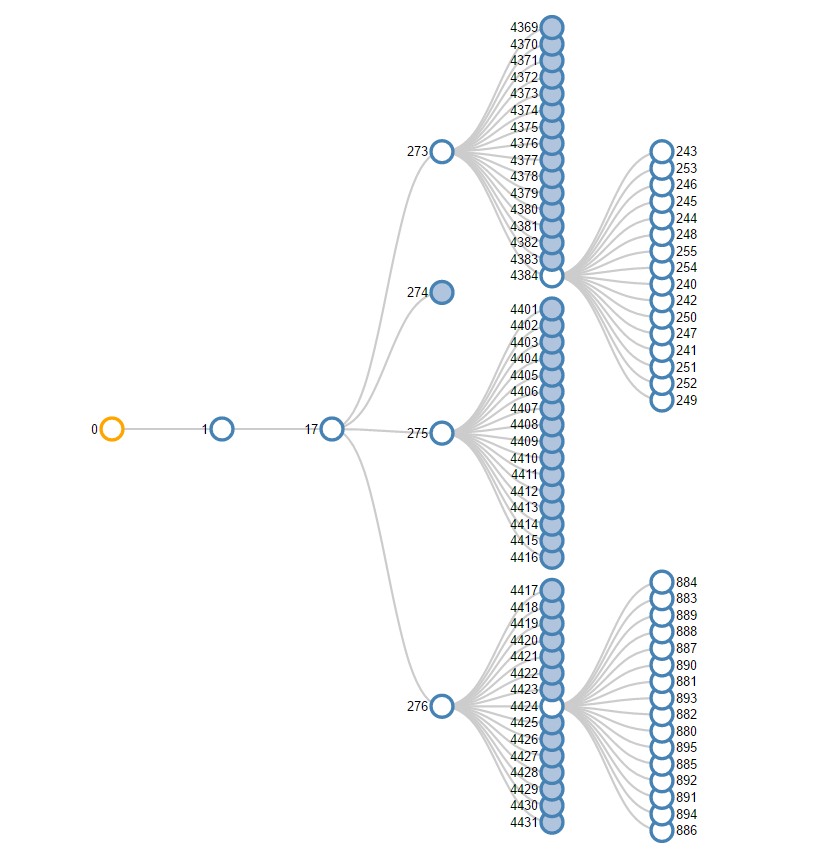

# treevisualization

The purpose is to make a visualization of a big tree structure using d3js.

## Big number of children [ ]

Example of a tree with partition size of 256:

## Visualizating all tree [ ]

Depending on the tree size, how to show it ?

## Visualizating tree path [x]

By selecting a object (tree leaf), it shows its path

